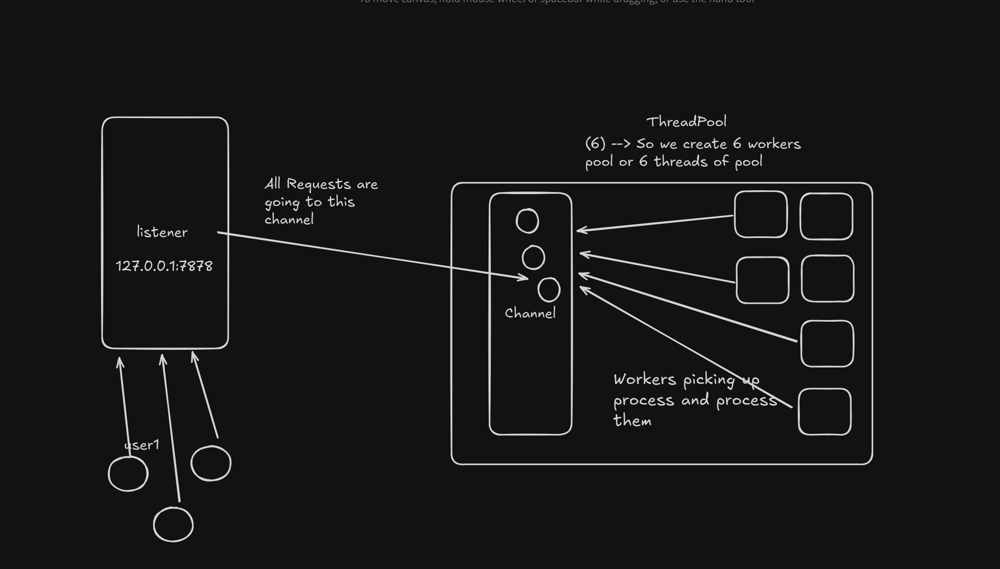

# 🦀  Multithreaded HTTP Server in Rust

This project demonstrates building a basic HTTP server entirely from scratch using Rust's standard library. It's designed to provide a deep understanding of networking, concurrency, and HTTP protocol fundamentals without relying on high-level frameworks.

## ✨ Core Technologies
- **std::net**: For low-level TCP communication (`TcpListener`, `TcpStream`).
- **std::thread**: For managing concurrent connections, eventually via a custom thread pool.
- **Manual Parsing**: Implementing custom logic to parse HTTP request bytes and format responses.

## 🚀 Key Features
- **TCP Listener**: Binds to a local address (e.g., `127.0.0.1:7878`) and accepts incoming connections.
- **Request Handling**: Reads raw bytes from the TCP stream and sends back simple HTTP responses.
- **Concurrency Model**: Utilizes a custom thread pool to efficiently handle multiple client requests simultaneously.
- **HTTP Request Parsing**: Manually parses the request line (Method, Path, HTTP-Version) and headers.
- **Static File Serving**: Serves static HTML files from a designated `public/` directory.
- **Basic Error Handling**: Returns `404 Not Found` for missing files and manages other common I/O errors.
- **Graceful Shutdown**: Implements a mechanism for clean server termination (e.g., via `Ctrl+C`).
- **Simple Logging**: Logs incoming requests for monitoring.

## 🛠️ Rust Concepts Reinforced
This project is an excellent way to solidify your understanding of:
- **Ownership & Borrowing**: Crucial for safe data sharing across threads.
- **Enums & Pattern Matching**: For structuring HTTP methods and request types.
- **Concurrency Primitives**: Deep dive into `std::thread`, channels (`std::sync::mpsc`), and mutexes.
- **Error Handling**: Extensive use of `Result` for robust application flow.
- **Byte & String Manipulation**: Efficient handling of network buffers and text processing.

## ▶️ Getting Started
To run this server:
1. Clone the repository.
2. Ensure you have Rust and Cargo installed.
3. Navigate to the project directory.
4. Run the server using `cargo run`.
5. Access it via your browser at `http://localhost:7878`.

# Architecture.

# Logs 

warning: `http_server_scratch` (bin "http_server_scratch") generated 4 warnings (run `cargo fix --bin "http_server_scratch"` to apply 1 suggestion)
    Finished `dev` profile [unoptimized + debuginfo] target(s) in 1.30s
     Running `target\debug\http_server_scratch.exe`
Server Runnin on PORT : TcpListener { addr: 127.0.0.1:7878, socket: 240 }
Worker 1 got a job; executing...
Request : GET / HTTP/1.1
Host: 127.0.0.1:7878
Connection: keep-alive
sec-ch-ua: "Chromium";v="140", "Not=A?Brand";v="24", "Google Chrome";v="140"
sec-ch-ua-mobile: ?0
sec-ch-ua-platform: "Windows"
Upgrade-Insecure-Requests: 1
User-Agent: Mozilla/5.0 (Windows NT 10.0; Win64; x64) AppleWebKit/537.36 (KHTML, like Gecko) Chrome/140.0.0.0 Safari/537.36
Accept: text/html,application/xhtml+xml,application/xml;q=0.9,image/avif,image/webp,image/apng,*/*;q=0.8,application/signed-exchange;v=b3;q=0.7
Sec-Fetch-Site: cross-site
Sec-Fetch-Mode: navigate
Sec-Fetch-User: ?1
Sec-Fetch-Dest: document
Accept-Encoding: gzip, deflate, br, zstd
Accept-Language: en-US,en;q=0.9,kn;q=0.8,fi;q=0.7

Worker 0 got a job; executing...
Request : GET /favicon.ico HTTP/1.1
Host: 127.0.0.1:7878
Connection: keep-alive
sec-ch-ua-platform: "Windows"
User-Agent: Mozilla/5.0 (Windows NT 10.0; Win64; x64) AppleWebKit/537.36 (KHTML, like Gecko) Chrome/140.0.0.0 Safari/537.36
sec-ch-ua: "Chromium";v="140", "Not=A?Brand";v="24", "Google Chrome";v="140"
sec-ch-ua-mobile: ?0
Accept: image/avif,image/webp,image/apng,image/svg+xml,image/*,*/*;q=0.8
Sec-Fetch-Site: same-origin
Sec-Fetch-Mode: no-cors
Sec-Fetch-Dest: image
Referer: http://127.0.0.1:7878/
Accept-Encoding: gzip, deflate, br, zstd
Accept-Language: en-US,en;q=0.9,kn;q=0.8,fi;q=0.7

Worker 2 got a job; executing...
Request : GET / HTTP/1.1
Host: 127.0.0.1:7878
Connection: keep-alive
sec-ch-ua: "Chromium";v="140", "Not=A?Brand";v="24", "Google Chrome";v="140"
sec-ch-ua-mobile: ?0
sec-ch-ua-platform: "Windows"
Upgrade-Insecure-Requests: 1
User-Agent: Mozilla/5.0 (Windows NT 10.0; Win64; x64) AppleWebKit/537.36 (KHTML, like Gecko) Chrome/140.0.0.0 Safari/537.36
Accept: text/html,application/xhtml+xml,application/xml;q=0.9,image/avif,image/webp,image/apng,*/*;q=0.8,application/signed-exchange;v=b3;q=0.7
Sec-Fetch-Site: none
Sec-Fetch-Mode: navigate
Sec-Fetch-User: ?1
Sec-Fetch-Dest: document
Accept-Encoding: gzip, deflate, br, zstd
Accept-Language: en-US,en;q=0.9,kn;q=0.8,fi;q=0.7

Worker 3 got a job; executing...
Worker 1 got a job; executing...
Request : GET /favicon.ico HTTP/1.1
Host: 127.0.0.1:7878
Connection: keep-alive
sec-ch-ua-platform: "Windows"
User-Agent: Mozilla/5.0 (Windows NT 10.0; Win64; x64) AppleWebKit/537.36 (KHTML, like Gecko) Chrome/140.0.0.0 Safari/537.36
sec-ch-ua: "Chromium";v="140", "Not=A?Brand";v="24", "Google Chrome";v="140"
sec-ch-ua-mobile: ?0
Accept: image/avif,image/webp,image/apng,image/svg+xml,image/*,*/*;q=0.8
Sec-Fetch-Site: same-origin
Sec-Fetch-Mode: no-cors
Sec-Fetch-Dest: image
Referer: http://127.0.0.1:7878/
Accept-Encoding: gzip, deflate, br, zstd
Accept-Language: en-US,en;q=0.9,kn;q=0.8,fi;q=0.7
